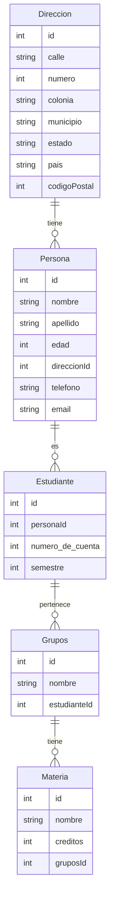

# Práctica 5

## Diagrama de entidad-relación

```mermaid
erDiagram
    Direccion ||--o{ Persona : "tiene"
    Persona ||--o{ Estudiante : "es"
    Estudiante ||--o{ Grupos : "pertenece"
    Grupos ||--o{ Materia : "tiene"

    Direccion {
        int id
        string calle
        int numero
        string colonia
        string municipio
        string estado
        string pais
        int codigoPostal
    }

    Persona {
        int id
        string nombre
        string apellido
        int edad
        int direccionId
        string telefono
        string email
    }

    Estudiante {
        int id
        int personaId
        int numero_de_cuenta
        int semestre
    }

    Grupos {
        int id
        string nombre
        int estudianteId
    }

    Materia {
        int id
        string nombre
        int creditos
        int gruposId
    }

```
